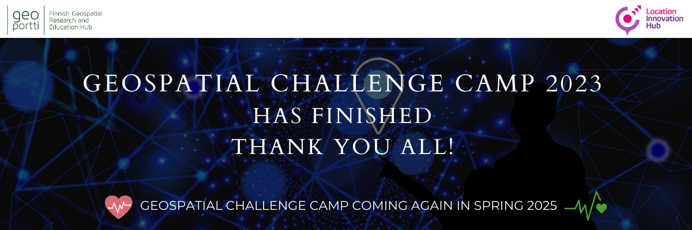

.. grid:: 1 3 3 3
    :gutter: 2

    .. grid-item-card:: :fas:`rocket` Why Geospatial Challenge Camp?
         :link: tabs/theme.html

         Geospatial Challenge Camp aims at engaging young scientists and students 
         to solve real-world sustainability challenges with digital data and 
         location technologies. In 2023, the topic of the challenge is 
         *Health and Wellbeing*.

    .. grid-item-card:: :fas:`bell` When?
        :link: tabs/schedule.html

        Starting on September 25-26th, 2023 with a kick-off event and 
        closing on December 1st, 2023. Multi-disciplinary teams of 
        young scientists work in close collaboration with different 
        stakeholders to co-create digital and social innovations 
        related to our health and wellbeing challenges.

    .. grid-item-card:: :fas:`plug` How to cooperate with us and sign-up for the challenge?
         :link: index.html#sign-up

         Researchers and students, check below how to sign-up for the Geospatial Challenge Camp 
         to boost your digital data and innovations skills and enlarge your networks.
         Collaborators, read more on how to be involved and match your digital health 
         and well-being information needs and opportunities with us.

Latest news
======================
The Geospatial Challenge Camp has ended! Click on the news images to find the online material.

.. carousel::
    :show_controls:
    :show_indicators:
    :show_dark:

    .. figure:: _static/news/news5-edited.png
      :target: https://challenge-camp.geoportti.fi/en/latest/tabs/materials/final_presentations.html

      .. 

      Solutions pitching at the final event of the Geospatial Challenge Camp 2023

    .. figure:: _static/news/news4-edited.png
      :target: https://challenge-camp.geoportti.fi/en/latest/tabs/final_event.html 

      .. 

      Stakeholders and public audience are welcome to join the Final Event and see the solution ideas of the **Geospatial Challenge Camp**

    .. figure:: _static/news/news1-edited.png
      :target: https://locationinnovationhub.eu/en/news/research-teams-develop-new-solutions-for-the-health-and-well-being-sector-in-ten-weeks-966/

      .. 

      Research teams develop new solutions for the Health and Well-being sector in GCC2023.
      Niina Käyhkö (left) and Sanna Jokela

    .. figure:: _static/news/news2-edited.png
      :target: https://csc-training.github.io/geocomputing_course/index.html

      .. 

      CSC concluded the Geocomputing training with Puhti supercomputer on 12.-13.10.2023.
      Check the open material

    .. figure:: _static/news/news3-edited.png
      :target: https://challenge-camp.geoportti.fi/en/latest/tabs/materials/opening_first_day.html

      .. 

      The kick-off opening event introduced the partners and the them on 25.-26.09.2023.
      Find the partner's presentation online

Sign up
==========

.. attention:: 
    
    Registration is closed!
..
  .. raw:: html
    
      

          

              

                  

                    
                      

                        <h5 class="card-title">Researchers and Students</h5>
                          
Read more about the aims, important dates and registration of the Challenge Camp 2023

..
  .. container:: custom-button

    `Sign Up <https://forms.gle/5NfP2RqVT1fuiyEU7>`_

..
  .. raw:: html

                      

                

              

          

                

                
                

                    <h5 class="card-title">Partners and Institutions</h5>
                    
Read more on how to work with us and how to sign-up as a partner. No costs, just great opportunities for you!

..
  .. container:: custom-button

    `Sign Up <https://forms.gle/Emo8MP8SNZfvcxqJ8>`__
..
  .. raw:: html

                

                

              

          

    

Overview
===========

.. raw:: html

   

   
The <b>Geospatial Challenge Camp</b> is a new skills development and innovation 
      service of <a href="https://www.geoportti.fi/">Geoportti Research Infrastructure</a>
      and <a href="https://www.maanmittauslaitos.fi/en/locationinnovationhub">Location Innovation Hub (LIH)</a>
      , 
      which is one of the European Digital Innovation Hubs. 
      The Geospatial Challenge Camp is a 10-week long challenge-based course (5 ECTS) 
      that aims to provide participants a chance to tackle relevant 
      real-world challenges in cross-disciplinary teams. 
      The participants are doctoral and post-doctoral researchers plus master students 
      from Finnish universities and research organizations. 
      They will work together in multidisciplinary teams and 
      collaborate with mentors and stakeholders.
      

   
The course aims to identify and analyze complex location and 
      time-related societal problems that requires the designing 
      and building of digital impact-driven solutions, scientists from 
      various disciplines will work together on real-world sustainable solutions.
      Participants will benefit their professional growth regarding the use of data, 
      technology, and application innovations stemming from the Geoportti project.
      

   
The challenges will be posed by societal actors, data providers, companies, 
      NGOs and innovation community actors and they will offer to Researchers the 
      chance to expand their data science solutions into new operative solutions 
      and make a broader societal impact in Finland and beyond.
   

   

Trusted partners
======================

.. carousel::
    :show_controls:
    :show_indicators:
    :show_dark:

    .. figure:: _static/logos/geoforum_c.png

      www.geoforum.fi

    .. figure:: _static/logos/healthhub_c.png
      
      www.healthhub.fi

    .. figure:: _static/logos/csc_c.png
         
      www.csc.fi

    .. figure:: _static/logos/gispo_c.png
         
      www.gispo.fi

    .. figure:: _static/logos/syke_c.png
         
      www.syke.fi

    .. figure:: _static/logos/varha_c.png
         
      www.varha.fi

    .. figure:: _static/logos/uturku_c.png
         
      www.utu.fi

    .. figure:: _static/logos/lih_c.png
         
      www.locationinnovationhub.eu

    .. figure:: _static/logos/aalto_c.png
         
      www.aalto.fi

    .. figure:: _static/logos/geoportti_c.png
         
      www.geoportti.fi

   

.. toctree::
   :maxdepth: 2
   :caption: Contents:
   :hidden:

   Theme<tabs/theme>
   Partners<tabs/partners>
   Researchers and Students<tabs/researchers>
   Full schedule<tabs/schedule>
   Kick-off meeting<tabs/kick_off>
   Mid-term meeting<tabs/mid_term>
   Final event<tabs/final_event>
   Materials & Info<tabs/materials/index>

..
               Indices and tables
               ==================

               * :ref:`genindex`
               * :ref:`modindex`
               * :ref:`search`
