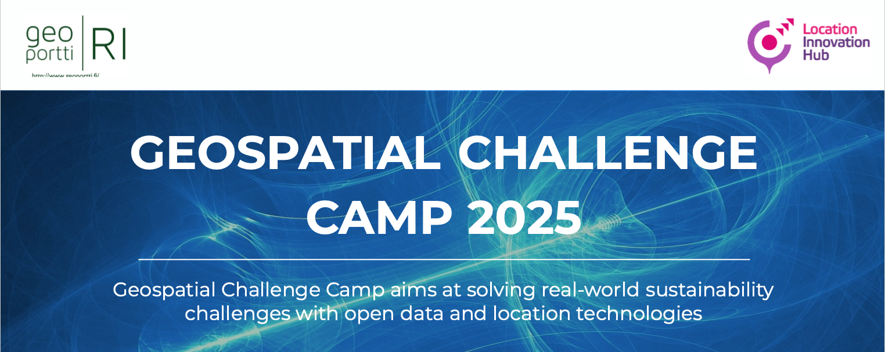

.. grid:: 1 3 3 3
    :gutter: 2

    .. grid-item-card:: :fas:`rocket` Why Geospatial Challenge Camp?
         :link: tabs/theme.html

         Geospatial Challenge Camp aims at engaging young scientists and students 
         to solve real-world sustainability challenges with digital data and 
         location technologies. In 2025, the topic of the challenge is
         *Health and Wellbeing*.

    .. grid-item-card:: :fas:`bell` When?
        :link: tabs/schedule.html

        Starting on February 13-14th, 2025 with a kick-off event and
        closing on May 6th, 2025. Multi-disciplinary teams of
        young scientists work in close collaboration with different 
        stakeholders to co-create digital and social innovations 
        related to our health and wellbeing challenges.

    .. grid-item-card:: :fas:`plug` How to cooperate with us and sign-up for the challenge?
         :link: index.html#sign-up

         Researchers and students, check below how to sign-up for the Geospatial Challenge Camp 
         to boost your digital data and innovations skills and enlarge your networks.
         Collaborators, read more on how to be involved and match your digital health 
         and well-being information needs and opportunities with us.

Overview
========

The Geospatial Challenge Camp is a skills development and innovation service of `Geoportti Research Infrastructure <https://www.geoportti.fi/>`__
and `Location Innovation Hub (LIH) <https://www.maanmittauslaitos.fi/en/locationinnovationhub>`__ which is one of the
European Digital Innovation Hubs. The Geospatial Challenge Camp is a 12-week long challenge-based course (5 ECTS)
that aims to provide participants a chance to tackle relevant real-world challenges in cross-disciplinary teams.
The participants are doctoral and post-doctoral researchers plus master students from Finnish universities and research organizations.
They will work together in multidisciplinary teams and collaborate with mentors and stakeholders.

The course aims to identify and analyze complex location and time-related societal problems that requires the designing
and building of digital impact-driven solutions, scientists from various disciplines will work together on real-world sustainable solutions.
Participants will benefit their professional growth regarding the use of data, technology, and application innovations stemming from the Geoportti project.

The challenges will be posed by societal actors, data providers, companies, NGOs and innovation community actors and they will offer to Researchers the
chance to expand their data science solutions into new operative solutions and make a broader societal impact in Finland and beyond.

Sign up
==========

.. grid:: 2
  :gutter: 2

  .. grid-item-card:: :fas:`rocket` Researchers and Students
      :img-top: _static/students.png

      Read more about the aims, important dates and registration of the Challenge Camp 2023

      .. button-link:: tabs/researchers.html
        :color: primary
        :shadow:
        :expand:

          Sign up!

  .. grid-item-card:: :fas:`bell` Partners and Institutions
      :img-top: _static/researchers.png

      Read more on how to work with us and how to sign-up as a partner. No costs, just great opportunities for you!

      .. button-link:: tabs/partners.html
        :color: primary
        :shadow:
        :expand:

           Sign up

Trusted partners
================

.. carousel::
    :show_controls:
    :show_indicators:
    :show_dark:

    .. figure:: _static/logos/geoforum_c.png

      www.geoforum.fi

    .. figure:: _static/logos/healthhub_c.png
      
      www.healthhub.fi

    .. figure:: _static/logos/csc_c.png
         
      www.csc.fi

    .. figure:: _static/logos/gispo_c.png
         
      www.gispo.fi

    .. figure:: _static/logos/syke_c.png
         
      www.syke.fi

    .. figure:: _static/logos/varha_c.png
         
      www.varha.fi

    .. figure:: _static/logos/uturku_c.png
         
      www.utu.fi

    .. figure:: _static/logos/lih_c.png
         
      www.locationinnovationhub.eu

    .. figure:: _static/logos/aalto_c.png
         
      www.aalto.fi

    .. figure:: _static/logos/geoportti_c.png
         
      www.geoportti.fi

.. toctree::
   :maxdepth: 2
   :caption: Contents:
   :hidden:

   Theme<tabs/theme>
   Partners<tabs/partners>
   Researchers and Students<tabs/researchers>