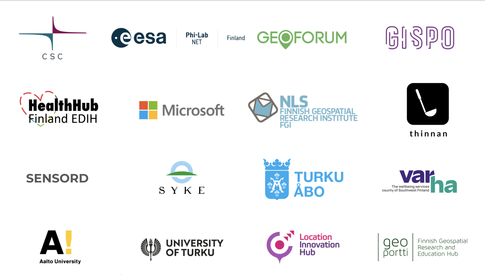

.. figure:: _static/banner_2026.png

.. grid:: 1 3 3 3
    :gutter: 2

    .. grid-item-card:: :fas:`rocket` Why Geospatial Challenge Camp?
         :link: tabs/theme.html

         The Geospatial Challenge Camp engages early-career researchers and students
         in addressing real-world sustainability challenges through the use of digital data and
         location technologies. In 2026, the theme of the challenge is
         **Sustainable Mobility and Transportation**.

    .. grid-item-card:: :fas:`bell` When?
        :link: tabs/schedule.html

        The camp begins with an on-site kick-off event on February 12–13, 2026, and concludes with a public final event on May 11, 2026, 
        where teams present their results. Multidisciplinary teams of early-career researchers will collaborate closely with stakeholders
        to co-create digital and societal innovations that advance sustainable mobility and transportation.

    .. grid-item-card:: :fas:`plug` How to cooperate with us and sign-up for the challenge?
         :link: index.html#sign-up

         Researchers and students can find below more information on registration and participation in the Geospatial Challenge Camp,
         an opportunity to strengthen skills in digital data, innovation, and interdisciplinary collaboration.
         Partners and organizations can learn how to participate and align their mobility and transportation goals with the camp's objectives.

Overview
========

The Geospatial Challenge Camp is a skills development service of `Geoportti Research Infrastructure <https://www.geoportti.fi/>`__ , 
a Finnish national research infrastructure providing geospatial data, tools, and computing resources for research and education, and
an innovation development service of `Location Innovation Hub (LIH) <https://www.maanmittauslaitos.fi/en/locationinnovationhub>`__ , one of the
European Digital Innovation Hubs.

This 13-week, challenge-based course (5 ECTS) gives doctoral, post-doctoral, and master’s students from Finnish universities and research organizations 
the opportunity to tackle real-world challenges in cross-disciplinary teams, collaborating closely with mentors and societal stakeholders.

The course focuses on identifying and analyzing complex societal problems related to location and time, and on designing and developing digital, impact-driven, sustainable solutions.
Participants will enhance their professional skills in using data, technology, and application innovations.

Challenges are posed by societal actors, data providers, companies, NGOs, and innovation community actors, offering participants the opportunity to translate 
geospatial and data science solutions into practical applications and create broader societal impact in Finland and beyond.

Sign up
==========

.. grid:: 2
  :gutter: 2

  .. grid-item-card:: :fas:`rocket` Researchers and Students
      :img-top: _static/students.png

      Learn about the objectives and registration details. Participate to enhance 
      your skills in geospatial data, digital innovation, and multidisciplinary collaboration.

      .. button-link:: tabs/researchers.html
        :color: primary
        :shadow:
        :expand:

          Sign up

  .. grid-item-card:: :fas:`bell` Partners and Institutions
      :img-top: _static/researchers.png

      Learn how to collaborate with the Geospatial Challenge Camp and become a partner. Participation is free, 
      offering opportunities to contribute expertise, data, and support while engaging with multidisciplinary teams.

      .. button-link:: tabs/partners.html
        :color: primary
        :shadow:
        :expand:

           Sign up

Trusted partners
================

.. toctree::
   :maxdepth: 2
   :caption: Contents:
   :hidden:

   Theme <tabs/theme>
   Partners <tabs/partners>
   Researchers and Students <tabs/researchers>
   Schedule <tabs/schedule>