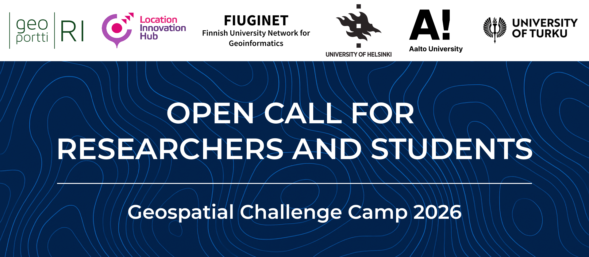

Researchers and Students
========================

This 13-week, challenge-based course (5 ECTS) offers doctoral, post-doctoral, and master’s students from 
universities and research organizations the opportunity to tackle challenges related to the theme in 
cross-disciplinary teams. Working closely with mentors and societal stakeholders, participants co-create sustainable 
geospatial solutions that address concrete needs in society. Through this process, they will develop their skills in teamwork, 
innovation, and stakeholder collaboration while learning to apply digital and spatial technologies for real-world impact.

The course starts with a two-day kickoff event, includes a midterm seminar, and concludes with a public final event where 
teams present their solutions to stakeholders, peers, and the wider community. Participants are expected to attend all 
on-site events and take part in weekly facilitated mentoring and group meetings, while additional teamwork is organized 
independently by each team.

Apply to participate
-------
Submit a brief motivation letter and your relevant background. 
Up to 30 participants will be accepted and notified once the review process is complete.

.. attention::

    Participant application is open!
    
    .. button-link:: https://forms.gle/fmXcg7Wm7pTC5hox6
            :color: primary
            :shadow:
            :align: center

            👉 Apply using this Form
    

Target audience and prerequisites
---------------------------------

.. grid:: 2
    :gutter: 4

    .. grid-item-card:: :fas:`mortar-board` Participants

        Primarily intended for **PhD students and early-career scientists** from universities and research organizations in Finland.

    .. grid-item-card:: :fas:`rocket` Other participants

        MSc students specializing in geoinformatics, geospatial sciences, or related fields are also encouraged to apply.

.. grid:: 2
    :gutter: 4

    .. grid-item-card:: :fas:`globe` Diverse backgrounds

        **Applicants from diverse backgrounds are encouraged to apply**, including
        geography, information technology, design, engineering, environmental sciences, social sciences, and communications.
        Researchers and students focusing on topics related to **Sustainable Mobility and Transportation** are 
        particularly encouraged to participate.  

    .. grid-item-card:: :fas:`person` Places available

        Up to **30 researchers and students** will be accepted to the Geospatial Challenge Camp.  
        A confirmation email will be sent to all selected participants. 

Learning objectives
-----------------

By participating in this course, you will:

- **Gain confidence** in working in multidisciplinary teams, assessing progress, communicating results, and engaging with stakeholders from diverse backgrounds.
- **Enhance scientific skills** to conceptualize complex, location-based societal challenges and address them using geospatial data, geoprocessing, automation, and digital technologies.
- **Develop teamwork and project management skills** to plan and manage multi-week projects, set sub-goals and milestones, coordinate team roles, and complete team deliverables.
- **Build technical competencies** to identify, use, assess, process, and apply geospatial data and digital technologies.
- **Strengthen business and solution thinking** to apply these skills in creating innovative, solution-oriented approaches that address real-world challenges and stakeholder needs.

Credits
-------

Participation and completion of the course is 5 ECTS. PhD and MSc students will receive
credits from their respective home institutions. Students not enrolled in a PhD or MSc programme
should discuss the credit arrangements with the Challenge Camp staff prior to registration.

Previous experiences
--------------------

See the videos below for researchers' experiences from previous years.

.. raw:: html

    <iframe src="https://aalto.cloud.panopto.eu/Panopto/Pages/Embed.aspx?id=099463ff-6c52-4335-bc4e-b26c00c82451&autoplay=false&offerviewer=false&showtitle=true&showbrand=true&captions=false&interactivity=all" height="405" width="720" style="border: 1px solid #464646;" allowfullscreen allow="autoplay" aria-label="Panopto Embedded Video Player" aria-description="Researcher experience: Venla Aaltonen" ></iframe>

.. raw:: html

    <iframe src="https://aalto.cloud.panopto.eu/Panopto/Pages/Embed.aspx?id=0f75382f-2358-4a27-a172-b26c00c8273a&autoplay=false&offerviewer=false&showtitle=true&showbrand=true&captions=false&interactivity=all" height="405" width="720" style="border: 1px solid #464646;" allowfullscreen allow="autoplay" aria-label="Panopto Embedded Video Player" aria-description="Researcher experience: Joha Jämsä" ></iframe>

Contact us
----------

.. grid:: 1

    .. grid-item-card::

        For questions or further information, please contact us by email at **geospatial-challenge@helsinki.fi**