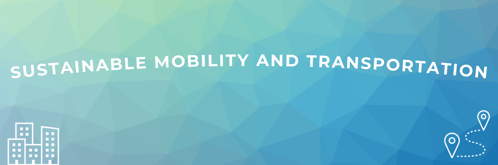

Theme
=======

Mobility is a fundamental aspect of societies, shaping how people access opportunities, services, and social connections.
At the same time, it presents challenges related to environmental impact, congestion, equity, public health, and other societal concerns.
**Sustainable mobility and transportation** seeks to understand and reimagine these dynamics through spatial, social, and environmental perspectives, promoting movement that supports well-being, inclusivity, and ecological balance.

In 2026, the Geospatial Challenge Camp invites participants to explore creative and innovative geospatial solutions and ideas that contribute to more sustainable and connected mobility and transportation in everyday life.

Possible application areas include:

- **Active Travel**: How can walking and cycling be made safer, more attractive, and better integrated into daily mobility?
- **Shared Mobility and Mobility as a Service (MaaS)**: How can shared bikes, scooters, and other vehicles, combined with integrated Mobility as a Service platforms, reduce car dependency and improve accessibility across regions and user groups?
- **Public Transport**: How can buses, trams, and metros become more efficient, inclusive, and connected to other modes of travel?
- **Electrification**: How can the transition to electric mobility transform urban energy use and infrastructure?
- **Smart Mobility**: How can data, AI, and digital tools optimize movement and enhance travel experiences?
- **Infrastructure and Green Environments**: How can transport and mobility infrastructure be designed and maintained to support sustainable, multimodal movement, while integrating green spaces and natural environments?
- **Resilience**: How can transport systems adapt to climate change and withstand environmental or social disruptions?
- **Accessibility and Environmental Justice**: Who benefits from sustainable mobility, and how can fair access and equitable distribution of environmental benefits and burdens be ensured?
- **Mobility Behavior**: How do lifestyles, social norms, and emerging work patterns influence travel choices and sustainability?

Sub-themes
============

The camp will focus on a set of subthemes that highlight different dimensions of sustainable mobility and transportation, offering inspiration 
for diverse perspectives and approaches. These sub-themes may evolve and expand as new partners, collaborators and, challenge topics are confirmed.

.. grid:: 1

    .. grid-item-card:: :fas:`bell`

            More details about the sub-themes will be provided soon.